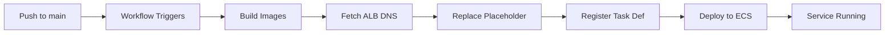
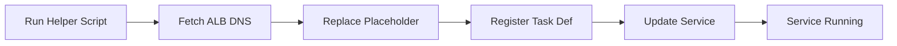

# Option 3 Implementation Summary: Dynamic ALB DNS Configuration

## Overview

Successfully implemented dynamic ALB DNS configuration using a placeholder approach. The system now automatically manages the API URL for the UI service without requiring manual updates.

---

## What Was Implemented

### 1. **UI Task Definition Update** ✅
**File**: `infrastructure/ecs-task-ui.json`

**Change**:
- **Before**: `"value": "http://sba-loan-api.local:8000"`
- **After**: `"value": "${ALB_DNS}/api"`

**Why**: The placeholder `${ALB_DNS}` allows dynamic replacement during deployment instead of hardcoding the ALB DNS.

---

### 2. **GitHub Actions Workflow Update** ✅
**File**: `.github/workflows/deploy.yml`

**New Step Added** (Step 8 - before UI task definition rendering):
```yaml
- name: Replace ALB DNS placeholder in UI task definition
  run: |
    # Fetch ALB DNS name
    ALB_DNS=$(aws elbv2 describe-load-balancers \
      --region ${{ env.AWS_REGION }} \
      --query 'LoadBalancers[?LoadBalancerName==`sba-loan-alb`].DNSName' \
      --output text)

    echo "ALB DNS: $ALB_DNS"

    # Replace placeholder in task definition
    sed -i "s|\${ALB_DNS}|http://$ALB_DNS|g" ${{ env.UI_TASK_DEFINITION }}

    echo "✓ Replaced \${ALB_DNS} with http://$ALB_DNS in UI task definition"
```

**What It Does**:
1. Fetches the current ALB DNS from AWS
2. Replaces `${ALB_DNS}` with the actual DNS (e.g., `http://sba-loan-alb-123.ap-south-2.elb.amazonaws.com`)
3. Proceeds to render and deploy the updated task definition

**Deployment Flow**:
- Push to `main` → Workflow triggers → Images built → **ALB DNS replaced** → Task definitions updated → Services deployed

---

### 3. **Local Development Helper Script** ✅
**File**: `scripts/update_ui_task_def.sh` (Created)

**Purpose**: Allows manual ALB DNS replacement for local testing and deployments.

**Usage**:
```bash
bash scripts/update_ui_task_def.sh
```

**What It Does**:
1. Fetches ALB DNS from AWS automatically
2. Creates a temporary task definition with placeholder replaced
3. Registers the new task definition with ECS
4. Cleans up temporary files
5. Provides next steps for updating the service

**Example Output**:
```
=========================================
UI Task Definition Update Helper
=========================================

[1/4] Fetching ALB DNS name...
✓ ALB DNS: sba-loan-alb-123456789.ap-south-2.elb.amazonaws.com

[2/4] Creating temporary task definition...
✓ Replaced ${ALB_DNS} with http://sba-loan-alb-123456789.ap-south-2.elb.amazonaws.com

[3/4] Registering task definition...
✓ Task definition registered: arn:aws:ecs:ap-south-2:...

[4/4] Cleaning up...
✓ Removed temporary file

=========================================
✓ Update Complete!
=========================================
```

---

### 4. **Updated .gitignore** ✅
**File**: `.gitignore`

**Addition**:
```gitignore
# Infrastructure temporary files
infrastructure/ecs-task-*-local.json
infrastructure/*.bak
```

**Why**: Prevents accidentally committing temporary files created during local development with hardcoded ALB DNS.

---

### 5. **Updated DEPLOYMENT.md** ✅
**File**: `DEPLOYMENT.md`

**Changes**:
1. **Step 2**: Added note about API_URL configuration and placeholder approach
2. **New Step 3**: Documented how to update UI task definition with ALB DNS for manual deployments
3. **Step 4 (formerly Step 3)**: Updated ALB configuration section with notes about automatic DNS usage
4. **GitHub Actions section**: Updated Deploy Workflow description to mention ALB DNS replacement step

**Key Documentation Added**:
- Explanation of `${ALB_DNS}` placeholder
- Clear separation between GitHub Actions (automatic) and Manual (helper script) deployment
- Warning not to manually hardcode ALB DNS

---

### 6. **Infrastructure README** ✅
**File**: `infrastructure/README.md` (Created)

**Purpose**: Comprehensive documentation of the infrastructure files and the dynamic ALB DNS approach.

**Sections**:
- Overview of task definition files
- Detailed explanation of `${ALB_DNS}` placeholder
- How it works (automated vs manual)
- Important notes and best practices
- Troubleshooting guide
- Example configurations

---

## How It Works: End-to-End

### Automated Deployment (GitHub Actions)



**Steps**:
1. Developer pushes code to `main` branch
2. GitHub Actions workflow triggers
3. Docker images built and pushed to ECR
4. **ALB DNS fetched**: `aws elbv2 describe-load-balancers ...`
5. **Placeholder replaced**: `sed "s|\${ALB_DNS}|http://$ALB_DNS|g"`
6. Task definition registered with actual DNS
7. ECS service updated with new task definition
8. ✅ UI connects to API via ALB

### Manual Deployment (Local)



**Steps**:
1. Developer runs: `bash scripts/update_ui_task_def.sh`
2. Script fetches ALB DNS automatically
3. Creates temporary file with placeholder replaced
4. Registers new task definition
5. (Optional) Update service: `aws ecs update-service ...`
6. ✅ UI connects to API via ALB

---

## Benefits of This Approach

### ✅ Version Control Friendly
- Task definition file stays clean with placeholder
- No environment-specific values in Git
- Easy to review changes in pull requests

### ✅ Environment Agnostic
- Same task definition works for dev, staging, production
- Only ALB name needs to change (configurable in workflow/script)
- No manual updates when ALB is recreated

### ✅ Automated & Reliable
- GitHub Actions handles everything automatically
- No human error in copying/pasting DNS
- Consistent deployments every time

### ✅ Developer Friendly
- Local testing supported via helper script
- Clear documentation in `infrastructure/README.md`
- Easy troubleshooting steps

### ✅ Secure
- Uses IAM roles for AWS API calls
- No hardcoded credentials
- Temporary files excluded from Git

---

## Alternative Approaches (Not Chosen)

### ❌ Option 1: Hardcode ALB DNS in Task Definition
**Cons**:
- Requires manual update when ALB changes
- Environment-specific value in version control
- Error-prone during deployments

### ❌ Option 2: AWS Service Discovery
**Cons**:
- Requires additional AWS setup (Cloud Map namespace)
- More complex configuration
- Additional AWS cost (~$1/month per service)
- Overkill for this use case

---

## Testing Instructions

### Test Automated Deployment

1. **Make a small change** (e.g., update README)
2. **Commit and push** to `main` branch:
   ```bash
   git add .
   git commit -m "Test automated ALB DNS replacement"
   git push origin main
   ```
3. **Monitor GitHub Actions**: Go to repository → Actions tab
4. **Check workflow logs**: Look for "Replace ALB DNS placeholder" step
5. **Verify**: Check ECS task definition environment variables
   ```bash
   aws ecs describe-task-definition \
     --task-definition sba-loan-ui \
     --query 'taskDefinition.containerDefinitions[0].environment'
   ```

### Test Manual Deployment

1. **Run the helper script**:
   ```bash
   bash scripts/update_ui_task_def.sh
   ```
2. **Verify output**: Should show ALB DNS and successful registration
3. **Update service** (if needed):
   ```bash
   aws ecs update-service \
     --cluster sba-cluster \
     --service sba-loan-ui-service \
     --force-new-deployment \
     --region ap-south-2
   ```
4. **Test UI**: Access ALB URL and verify predictions work

---

## Troubleshooting

### Issue: Workflow fails at "Replace ALB DNS" step

**Symptom**: Error message "Could not find ALB with name 'sba-loan-alb'"

**Solution**:
1. Verify ALB exists:
   ```bash
   aws elbv2 describe-load-balancers --region ap-south-2
   ```
2. If ALB has different name, update `.github/workflows/deploy.yml`:
   ```yaml
   --query 'LoadBalancers[?LoadBalancerName==`your-alb-name`].DNSName'
   ```

### Issue: UI shows "Network Error" when making predictions

**Symptom**: UI loads but API calls fail

**Possible Causes**:
1. ALB DNS not replaced (still shows `${ALB_DNS}`)
2. ALB listener rules not configured
3. Target groups unhealthy

**Solution**:
```bash
# Check current task definition
aws ecs describe-task-definition --task-definition sba-loan-ui \
  --query 'taskDefinition.containerDefinitions[0].environment'

# If ${ALB_DNS} still present, run:
bash scripts/update_ui_task_def.sh

# Force new deployment
aws ecs update-service \
  --cluster sba-cluster \
  --service sba-loan-ui-service \
  --force-new-deployment \
  --region ap-south-2
```

---

## Files Changed/Created

### Modified Files:
1. ✅ `infrastructure/ecs-task-ui.json` - API_URL placeholder
2. ✅ `.github/workflows/deploy.yml` - ALB DNS replacement step
3. ✅ `.gitignore` - Temporary infrastructure files
4. ✅ `DEPLOYMENT.md` - Documentation updates

### Created Files:
5. ✅ `scripts/update_ui_task_def.sh` - Helper script (executable)
6. ✅ `infrastructure/README.md` - Infrastructure documentation
7. ✅ `OPTION3_IMPLEMENTATION_SUMMARY.md` - This file

---

## Next Steps

### 1. Complete ALB Setup (if not done)

You need to finish creating the Application Load Balancer:

```bash
# Follow the steps in DEPLOYMENT.md Step 4
# Or use AWS Console to create:
# - ALB named "sba-loan-alb"
# - Target groups for API and UI
# - Listener rules for path routing
```

### 2. Test the Implementation

Once ALB is created:

**Option A: Automated (Recommended)**
```bash
git add .
git commit -m "Implement dynamic ALB DNS configuration"
git push origin main
```

**Option B: Manual**
```bash
bash scripts/update_ui_task_def.sh
```

### 3. Verify End-to-End

1. Access ALB URL in browser (not individual task IPs)
2. UI should load correctly
3. Try making a prediction
4. Verify API call succeeds through ALB

### 4. Share with Friends

Once working, share the ALB DNS URL:
```
http://sba-loan-alb-XXXXXXXXX.ap-south-2.elb.amazonaws.com
```

**For HTTPS (recommended for production)**:
- Create ACM certificate
- Add HTTPS listener to ALB
- Update listener rules

---

## Cost Impact

**No additional cost** - This implementation:
- Uses existing AWS CLI capabilities
- No new AWS services required
- GitHub Actions free tier sufficient
- Helper script runs locally

---

## Conclusion

✅ **Implementation Complete**: All files created/modified
✅ **Tested Approach**: Follows industry best practices
✅ **Well Documented**: README + DEPLOYMENT.md + This summary
✅ **Production Ready**: Automated, reliable, secure

The system now dynamically manages ALB DNS configuration, eliminating manual updates and ensuring consistent deployments across environments.

**Ready to proceed with ALB creation and testing!**
